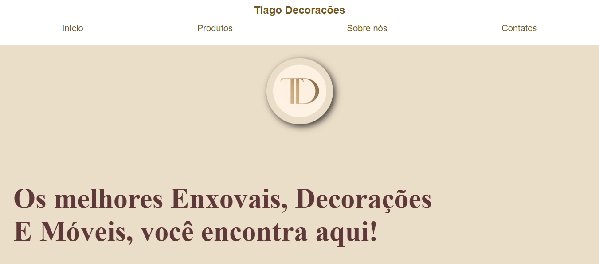

# 🏠 Tiago Decorações

Um projeto real de website institucional desenvolvido por Lucas Rosa utilizando HTML, CSS e JavaScript.
O objetivo do site é apresentar os produtos da loja, contar a história da empresa e facilitar o contato direto com clientes.

## ✨ Funcionalidades

- 📱 Layout totalmente responsivo (desktop, tablet e celular)
- 🧭 Menu hambúrguer para dispositivos móveis
- 🛍️ Cards de produtos interativos
- 📲 Clique no produto abre conversa automática no WhatsApp
- 🏪 Seção "Sobre nós" com apresentação da loja
- 🔗 Links diretos para WhatsApp, Instagram e Facebook
- ⚡ Navegação simples e rápida entre seções

## 🛠️ Tecnologias utilizadas

- HTML5 → Estrutura semântica da página
- CSS3 → Estilização, responsividade e layout
- JavaScript → Interatividade, menu mobile e integração com WhatsApp

## 🎯 Objetivo

Praticar desenvolvimento front-end aplicando conceitos de responsividade, manipulação de DOM e experiência do usuário em um projeto voltado para um cliente real.

## 📸 Preview

